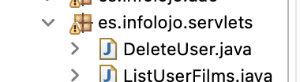
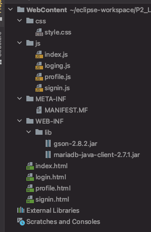
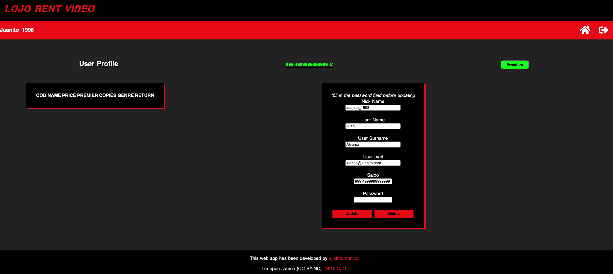
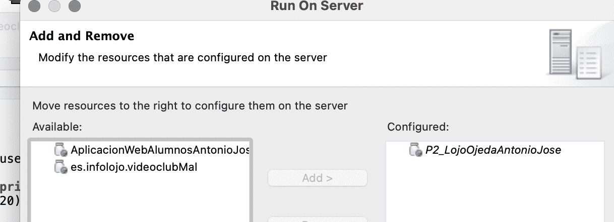

# LOJO RENT VIDEO
REST API Web Application. Encoded in JAVA following the DAO design pattern on a TOMCAT 8.5 server. The application client has been maked by AJAX requests simulating the operation of a video store.

## Developed with 🛠️

_Tools and technologies:_

* [Eclipse Enterprise](https://www.eclipse.org/) - IDE Project, JAVA.
* [WebStorm](https://www.jetbrains.com/es-es/webstorm) - IDE Front development (JS, CSS3, HTML5).
* [Mysql](https://www.mysql.com/) - Database .
* [MySQL Connect](https://dev.mysql.com/downloads/connector/j/) - Database Connector.
* [Gson Java](https://jar-download.com/artifacts/com.google.code.gson/.gson/2.8.2/source-code) - Gson Library.
* [OPEN JDK 11](https://openjdk.java.net/projects/jdk/11/) - JAVA 11.
* [jQuery](https://code.jquery.com/) - For Ajax methods.

### Ide: 🚀

* ***Eclipse Enterprise Edition :***
  * Project Structure and Back development (JAVA 11).
* ***WebStorm :***
  * Client development at WebContent package (HTML, CSS3, JS ES 6, jQuery for Ajax calls).
* ***WorkBench:***
  * viodeoclub database and seeders .

### Structure: 🧱
    
_Structure of the project is as follows:_

* ***Back:***
  * In JAVA resources package is.infolojo the project on the server side is built following a DAO architecture .
  
    
  
  * At servlets package are all the servlets with which the Java classics communicate with the JS CLIENT following a Rest Api structure from Ajax calls sending the data in Json.

    

* ***Front:***
  * At Web Content In ./WebContent respectively there are both the client and the libraries (.jar) that I use in the project (***Mysql connector && Google.Json.***)
  
    

* ***Data Base:***
  * As database i have use For the database I have used MySQL and the WorkBench tool to create the scripts.
   
    

  
  * The scripts are at ./sql directory .
    
---

## What can you do with it 😄

_Once you carry out the previous steps explained in the following points, you will be able to test my application and its functionalities._

### Login and Sign users with a beautifull, responsive and asynchronous js


### rent movies updating copies as you rent


### Update your wallet, change the premium, return movies or delete your user 




---

## Doplyment 🚀

_Clone repository or download zip_.

Import as Dinamic Proyect LojoRentVideo folder at ***Eclipse Enterprise*** and do the
folowing instructions.

### Pre-requirements 📋

_1 MySQL 8.9 or hihg, JAVA 11, Eclipse Enterprise & Tomcat 8.5._

### Install and run 🔧

_2 Install tomcat 8.5 and import it on eclipse._

```
https://tomcat.apache.org/download-80.cgi
```

_3 Add Jars at "./WebContent/WEB-INF/lib/" to Java build path as the following image._


_4 Change Database settings at "./src/es/infolojo/connect/DBConnection.java"._

```
 static String bd = "videoclub";
 static String login = "root";
 static String password = ""; //input here your name and passwd of mysql
 static String url = "jdbc:mysql://localhost/"+bd;
 Connection connection = null;
```

_5 run videoclub.sql on mysql to create the database app._

_6 execute as java aplication Testing.java at "/src/es/infolojo/system/Testing.java to make
seeders or run seeder.sql._


_7 add project to Tomcat 8.5._




## Executing ⚙️

_Execute Tomcat and go to:_

```
http://localhost:8080/LojoRentVideo
```

## Deplyment in comming 📦

_Right now im workin in another projects but i will buld .war with the aplication._ 🤓


## Contributing 🖇️

You can [Fork my work](https://github.com/ajloinformatico) and use it as a base or improve it.

## Web Site 🌐

Visit my personal website and see a little more about me.

## Version Control 📌

Im open source. Just ❤️ GitHub.

## Author ✒️

_This web aplication has been developed by:_

* **Antonio José Lojo Ojeda** - *Trabajo Inicial* - [ajloinformatico](https://github.com/ajloinformatico).


## License 📄
_I'm open source (CC BY-NC) [INFOLOJO](https://www.infolojo.es)._

Use my work if you want, imporove it but mention and ask me before deploy.


## Thanks 🎁

* Comment with your friends about my work 📢.
* Enjouy it 🍺  ☕ . 
* mention this job in your social networks🤓.
* etc.

---
⌨️ with ❤️ by [INFOLOJO](https://www.infolojo.es) 🧑‍💻.